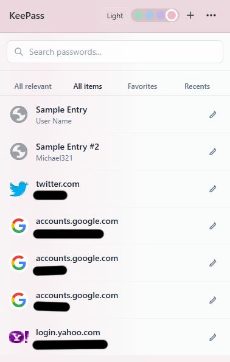
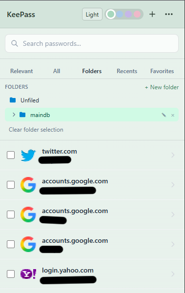
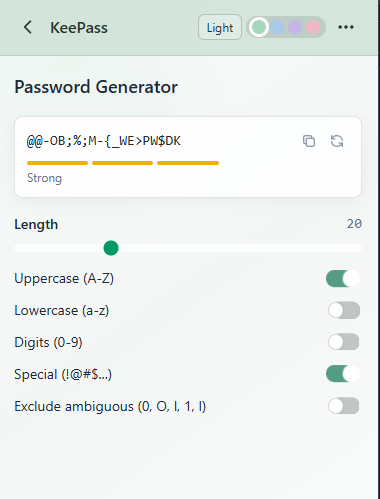
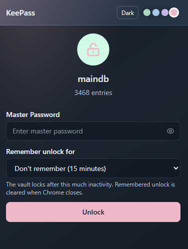
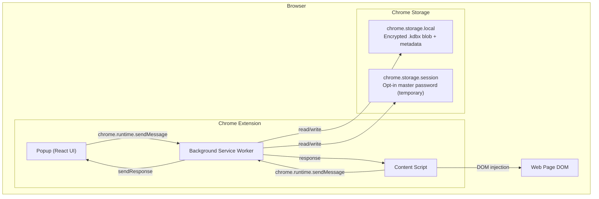

# KeePass Chrome Extension

[Русский](README.ru.md) | **English**

KeePass-compatible password manager as a Chrome extension. Vault data is encrypted and stored locally. Optional leaked-password checks send partial password hashes to Have I Been Pwned after your confirmation.

## Quick look

<p align="center">
  
  
</p>
<p align="center"><sub>Entry list</sub> &nbsp; · &nbsp; <sub>Folder selection</sub></p>

<p align="center">
  
  
</p>
<p align="center"><sub>Password generator</sub> &nbsp; · &nbsp; <sub>Unlock and Remember Unlock</sub></p>

## Features

- **Create and open `.kdbx` databases** — full KeePass 2.x compatibility
- **Import/export** — open existing KeePass database or create a new one
- **Password management** — add, edit, delete entries; fill in URL for autofill on sites
- **Secure notes and TOTP** — store encrypted notes and protected Base32 authenticator seeds; generate rotating six-digit codes locally
- **Entry views** — switch between relevant entries for the current site, all items, favorites, and recent entries
- **Favorites and recents** — mark important entries as favorites; keep the 20 most recently copied or filled entries at hand
- **Search** — quick search by title, login, URL and tags within the selected entry view
- **Password generator** — configurable generator with strength meter
- **Password health checks** — find weak passwords locally and optionally check for passwords in known breach data using a privacy-preserving HIBP lookup
- **Click-to-fill** — fills a login form only after you click the on-page Fill control or choose an entry in the popup
- **Save after sign-in or signup** — offers to add or update a vault record after a password form is submitted
- **Light and dark appearance** — light is the default; switch modes from the header and choose a green, blue, purple, or pink accent
- **Soft interface styling** — translucent one-pixel borders, subtle surfaces, and quiet entry-row hover effects
- **Copy to clipboard** — with auto-clear after 15 seconds
- **Configurable auto-lock** — locks after 15 minutes by default, with optional Remember Unlock durations of 1 hour, 8 hours, 1 day, or 1 week
- **Encrypted backups** — create local snapshots, restore a selected snapshot, and change the master password
- **Per-site access** — grant autofill and save-password access only to sites you choose

## Security

- Master password is not stored by default. If you opt into Remember Unlock, it is held in browser session storage until the selected time expires, you manually lock or replace/delete the vault, or the browser exits
- Master-password recovery is not supported. Keep the master password safe and export the encrypted `.kdbx` database to a separate location; changing the password re-encrypts the vault and replaces local snapshots
- Form drafts restore non-secret fields only; master passwords and entry passwords are not stored as drafts
- Database stored encrypted (AES-256 / ChaCha20) in `.kdbx` format
- Encryption key exists in memory only while the database is unlocked
- Autofill uses exact-domain matches, requires a user click, and can be disabled per entry
- Filling credentials never submits the website's form
- After you submit a password sign-in or signup form, pending credentials remain in local memory until you save or dismiss the offer; a short-lived in-memory handoff supports full-page navigation
- Credentials are added or updated only after you choose **Save** or **Update**. If the vault is locked or unavailable, pending values are discarded
- Clipboard is automatically cleared after copying a password
- Database deletion always requires fresh master-password verification. Entry deletion uses an active Remember Unlock session when available; otherwise it asks for the master password. A password entered for confirmation is not stored or logged

## Installation

### Requirements

- [Node.js](https://nodejs.org/) 18 or higher
- Google Chrome (or any Chromium-based browser)

### Build from source

```bash
# Clone the repository
git clone https://github.com/nenjotsu/keepass-chrome-extension.git
cd keepass-chrome-extension

# Install dependencies
npm install

# Build the extension
npm run build
```

The built extension will be in `.output/chrome-mv3/`.

### Load in Chrome

1. Open `chrome://extensions/` in Chrome
2. Enable **Developer mode** (toggle in top right)
3. Click **Load unpacked**
4. Select the `.output/chrome-mv3/` folder

## Development

```bash
# Start dev server with hot reload
npm run dev

# TypeScript type check
npm run compile

# Run unit tests
npm test

# Build for Firefox
npm run build:firefox

# Create .zip for publication
npm run zip
```

With `npm run dev`, the extension with hot reload will be in `.output/chrome-mv3-dev/` — load that folder via "Load unpacked" in Chrome.

## Usage

### First launch

1. Click the extension icon in the Chrome toolbar
2. Choose **Create New** to create a new database or **Import File** to open an existing `.kdbx` file
3. Set a master password (at least 8 characters)

### Remember Unlock

On the Unlock screen, choose **Don't remember** or opt into **1 hour**, **8 hours**, **1 day**, or **1 week**. The selected time is an inactivity timeout: using the extension resets the timer, while passive page matching does not. Your last choice is preselected the next time you unlock.

With Remember Unlock enabled, the extension temporarily keeps your master password in browser session storage so it can reopen the vault after its background service worker restarts. The password is saved only after a successful unlock, and is cleared when the timeout expires, you manually lock the vault, import or delete a vault, or close Chrome. **Don't remember** is the default; it keeps the existing 15-minute in-memory unlock, but a service worker restart may require you to enter the master password again.

### Password management

- **Import logins from CSV** — use the import button in the unlocked vault header to import CSV exports from Chrome, Brave, Microsoft Edge, Bitwarden, LastPass, or another manager. Review and map columns, skip rows without passwords and duplicates by default, and undo the latest import while the popup remains open. CSV data is processed locally; non-login item types are not imported.
- **Add entry** — "Add Entry" button at the bottom of the list
- **View** — click an entry in the list
- **Edit** — choose the "Edit" button on the entry page; the edit screen includes a trash icon for deleting that entry
- **Favorite** — use the star button on the entry page to add or remove an entry from Favorites
- **Folders** — create, rename, and delete folders in the entry list. In the Folders view, choose a folder to filter its passwords, then use **Select all** or the checkboxes to select entries (search narrows the selection); use the move bar to move them to another folder. All items, Favorites, and Recents also support selecting and moving multiple passwords. Deleting a folder moves its passwords to Unfiled and lifts its subfolders one level.
- **Delete** — choose "Delete" on the entry page or the trash icon while editing. Confirm the deletion; the master password is requested if Remember Unlock is not active. An incorrect password leaves the entry unchanged and allows another attempt.
- **Copy** — copy icon next to login, password, and URL fields

The popup always restores the last page and form drafts when reopened. You can close it to copy from elsewhere — your data will be there when you reopen.

The entry list has five views:

- **All relevant** — entries whose saved hostname exactly matches the active browser tab; selecting one fills the login form directly
- **All items** — every vault entry
- **Favorites** — starred entries, in vault order
- **Recents** — up to 20 distinct entries, ordered by most recently copied or filled
- **Folders** — choose a folder to show its passwords; search narrows the displayed entries and **Select all** selects those displayed entries. Move selected passwords with the move bar.

If there are no relevant entries for the current site, the popup starts on **All items**. Searches narrow the currently selected view.

### Password generator

Available via the key icon in the header or when creating/editing an entry (refresh button next to the password field). Options:
- Length (4–64 characters)
- Uppercase / lowercase letters
- Digits
- Special characters
- Exclude ambiguous characters (0/O, 1/l/I)

### Autofill

**Fill in the URL field** when creating or editing an entry — this is required for autofill. Enter just the hostname (e.g. `italki.com` or `mail.example.com`); no `https://` needed.

Before autofill or save prompts can run on a site, choose **Enable access on this site** from the extension menu and grant access. Refresh that page after granting permission. Access is requested per origin.

When you visit a login page with a matching entry that has **Allow Auto Fill** enabled:

1. The extension waits for a visible password field and finds entries matching the exact hostname. It does not put credentials into the page automatically.
2. Click the **Fill** control beside the password field to fill the first match, or open the popup, choose the entry you want, and click **Fill**.
3. Filling never submits the login form; review the page and submit it yourself.

When the vault is unlocked, the extension icon shows how many Auto Fill-enabled login entries match the active tab's exact hostname. The badge clears when there are no matches or the vault is locked, and displays `99+` for 100 or more matches.

Each entry has an **Allow Auto Fill** checkbox, enabled by default. Turn it off to exclude that entry from matching and fill suggestions. **Remember Unlock** is a separate opt-in on the unlock screen; its selected duration controls how long the master password remains available for automatic re-unlock.

Choose **Secure note** as the entry type to save private text without login fields. Login entries may also store a Base32 authenticator secret; its six-digit TOTP code is generated locally and refreshes every 30 seconds.

You can also open the extension popup on a matching page and select an entry from **All relevant** to fill it directly. Entries with Auto Fill disabled are not offered for filling.

### Save passwords from websites

After you submit a password-based sign-in or signup form, KeePass offers to save the submitted username and password when the page navigates or the form disappears. If the site gives no clear signal, it shows an offer after five seconds and marks the result as unconfirmed. Password-change forms are ignored.

Review the title, website, username, and password in the on-page prompt before choosing **Save**. New records go to the root group by default; you can select another group. A new record enables **Allow Auto Fill**. If the same exact hostname and username already exist, the prompt offers **Update**; it keeps other entry details unless you edit them in the prompt. **Never** dismisses only that offer.

The prompt is available only while the vault is unlocked. If the vault is locked or unavailable, pending credentials are discarded. Credentials are kept in memory briefly across a full-page navigation and are never sent to a remote service.

### Delete a database

Use the trash icon in the header, then enter the master password in the deletion dialog. The database is removed only after successful verification; canceling or entering a wrong password leaves it intact.

### Backups and master password

Open **Backups & Master Password** from the menu to create a local encrypted snapshot or restore one. Snapshots are also created after ten edits and on the next save after an hour has elapsed. Snapshots live in the browser profile, so periodically use **Export Database** and store the `.kdbx` file somewhere separate. Changing the master password re-encrypts the vault and replaces old snapshots because they use the previous password.

There is no master-password recovery. If the password is lost, the vault cannot be decrypted; an exported backup protects against device or browser-profile loss, not a forgotten password.

### Appearance

Use the Light/Dark control in the header to switch appearance; light is the default. Use the four color swatches to choose green, blue, purple, or pink accents. Both settings persist between popup sessions.

## Project structure

```
├── entrypoints/
│   ├── background.ts          # Service Worker — extension core
│   ├── content.ts             # Content Script — detects login forms and offers click-to-fill
│   └── popup/                 # Popup UI (React)
│       ├── App.tsx            # Page routing
│       ├── pages/             # CreateVault, Unlock, EntryList,
│       │                      #   EntryDetail, EntryForm, Generator
│       └── components/        # PasswordInput, CopyButton, StrengthMeter
├── lib/
│   ├── kdbx.ts                # kdbxweb wrapper — .kdbx database handling
│   ├── credential-save.ts     # Sign-in/signup form classification
│   ├── page-autofill.ts       # Fills a login form after an explicit user action
│   ├── crypto-setup.ts        # Argon2 (hash-wasm) init for kdbxweb
│   ├── storage.ts             # chrome.storage.local / session persistence
│   ├── messages.ts            # Typed messaging API
│   ├── password-generator.ts  # Password generator
│   ├── clipboard.ts           # Copy with auto-clear
│   ├── types.ts               # Shared TypeScript types
│   ├── constants.ts           # Settings and constants
│   └── fflate-worker-shim.js  # fflate compatibility shim for MV3 SW
├── wxt.config.ts              # WXT + Vite + Tailwind config
├── tsconfig.json
└── package.json
```

## Tech stack

| Technology | Purpose |
|---|---|
| [TypeScript](https://www.typescriptlang.org/) | Development language |
| [WXT](https://wxt.dev/) | Chrome Extensions framework (Manifest V3) |
| [React 19](https://react.dev/) | UI framework |
| [Tailwind CSS 4](https://tailwindcss.com/) | Styling |
| [kdbxweb](https://github.com/nicolo-ribaudo/nickel-keepass) | .kdbx format handling (KeePass 2.x) |
| [hash-wasm](https://github.com/nickel-nickel/nickel-hash-wasm) | Argon2 key derivation (WASM) |
| [Vite](https://vite.dev/) | Bundler (via WXT) |

---

## Architecture

### High-Level Overview

The extension follows Chrome Manifest V3 with three isolated components communicating via Chrome messaging APIs:



### Component responsibilities

**Background Service Worker** — central hub; database ops, crypto init, message routing, auto-lock/unlock, clipboard management.

**Popup UI** — React SPA (CreateVault, Unlock, EntryList, EntryDetail, EntryForm, Generator).

**Content Script** — detects password fields on every page, requests matching entries from background, displays the KeePass logo on detected fields, and fills credentials when the icon is clicked.

### Message protocol

Typed messages in `lib/messages.ts`: GET_STATE, CREATE_DATABASE, IMPORT_DATABASE, UNLOCK, LOCK, GET_ENTRIES, GET_ENTRY, CREATE_ENTRY, IMPORT_CSV_ENTRIES, UNDO_CSV_IMPORT, UPDATE_ENTRY, GET_DELETE_PASSWORD_REQUIREMENT, DELETE_ENTRY, GET_GROUPS, GENERATE_PASSWORD, COPY_TO_CLIPBOARD, EXPORT_DATABASE, GET_ENTRIES_FOR_URL, FILL_IN_TAB.

### Security

- **Encryption**: Argon2 KDF → AES-256-CBC / ChaCha20, ProtectedValue for fields
- **Session**: remembered master password only after explicit opt-in; cleared on browser quit, manual lock, vault replacement/deletion, or inactivity expiry
- **Auto-lock**: 15 min by default; can be extended with the Unlock screen's Remember option
- **Clipboard**: auto-clear 15 s after copy

### Storage

| Layer | Contents | Lifetime |
|---|---|---|
| chrome.storage.local | Encrypted .kdbx blob, metadata, Remember Unlock duration preference | Persistent until uninstall |
| chrome.storage.session | Optional remembered master password and temporary form drafts | Until browser quit; remembered unlock also expires after the chosen inactivity period |
| In-memory | Decrypted Kdbx | Until lock / SW termination |

## License

MIT
